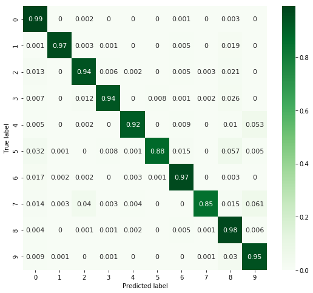
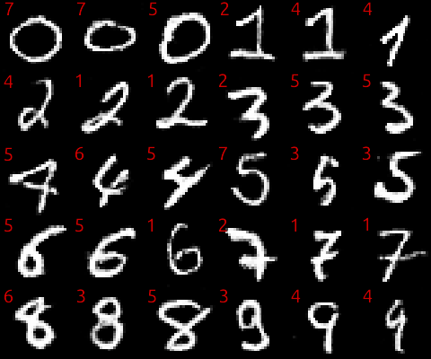
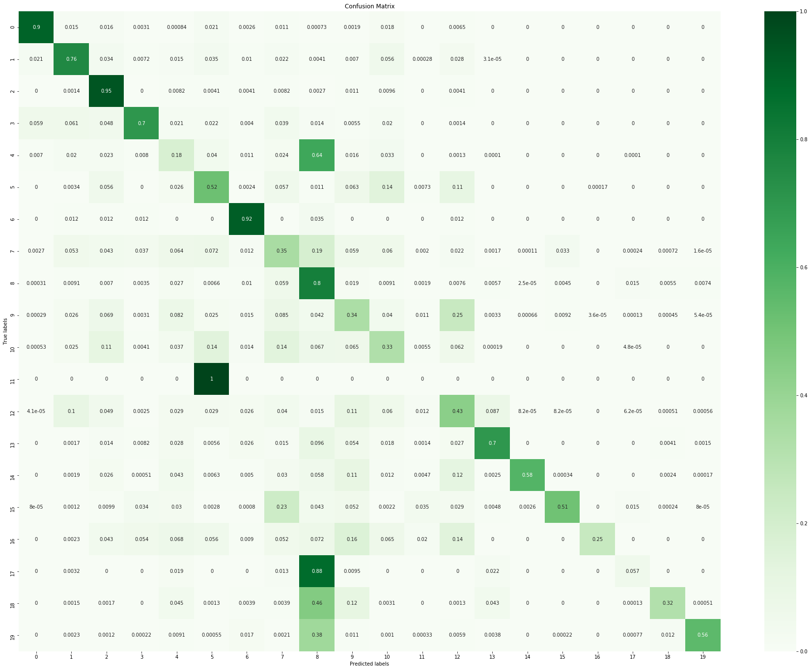
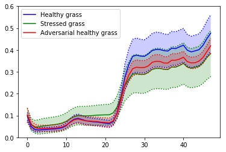
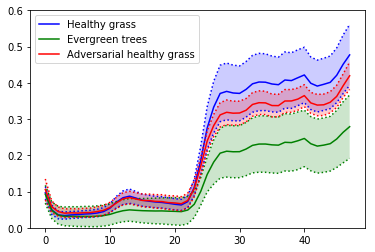

# AdvWGAN

AdvWGAN is designed to generate adversarial example by using a modified WassersteinGAN and can be use with black-box classifier. 

# Use

## Pretrained Classifiers and Models

All files are available [here](https://drive.google.com/drive/folders/1U7eGEJhWQ3MIy9Mpg19NgwdBqyiuPC3k?usp=sharing)

## Classifier

You first need a classifier, here we use the following class to define one.

    class Classifier:
    
    def  __init__(self, path='saved_models/FC_DFC'):
        self.path = path
        
    def load_model(self):
        json_file = open(self.path+'.json', 'r')
        loaded_model_json = json_file.read()
        json_file.close()
        self.model = model_from_json(loaded_model_json)
        
    def load_weights(self):
        self.model.load_weights(self.path+".h5")

    def predict(self, X):
        X = np.reshape(X, (-1, 48))
        return self.model.predict_proba([X])

## Dataset 

You must use a dataset object like

      data = dataset.Dataset(X, y)

## WGAN

For the wgan you can use your own methods or user some of ours

    generator = models.make_g_conv_1d(img_size=48, hiddens_dims=[256,128,64], o=tf.nn.tanh)
    discriminator = models.make_d_conv_1d(hiddens_dims=[64,128,256])
 
   Then the easiest way to create a gan is by using a CFG file

    advgan = gan.make_gan('cfg/DFC.cfg')

You have to set your generator, discriminator, classifier and dataset

    advgan.set_generator(generator)
    advgan.set_discriminator(discriminator)
    advgan.set_classifier(classifier)
    advgan.set_dataset(data)

Finally, you can build your model

    advgan.build_model(reset_graph=True)

## Training

Training is pretty straightforward, the only thing tricky is the print function you want, you can use one of ours or code your own

    advgan.train(print_method= print_functions.plot_samples_mean_std())

## Generate

Once training is done, you can use the generator like this

    g = advgan.load_and_generate('AdvGAN_DFC_ct', batch_size=512)

# Some Results

## [MNIST](http://yann.lecun.com/exdb/mnist/)

With this classifier

You can generate these images, in red you can see the prediction

## [DFC2018](http://www.grss-ieee.org/community/technical-committees/data-fusion/2018-ieee-grss-data-fusion-contest/)

With this classifier

You can generate these spectrum (class 1)

